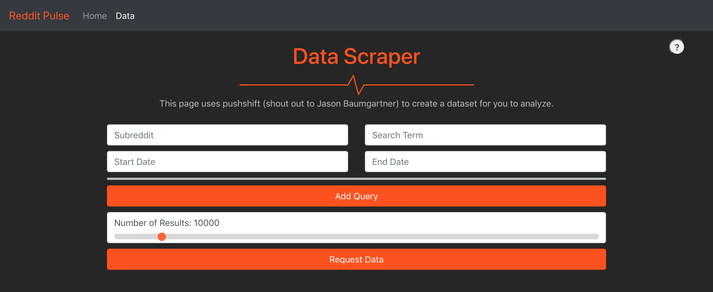

# redditPulse
## A website for assisting with training topic models on Reddit data. 

Currently, this tool automatically pulls large data sets from pushshift and delivers them either in their original format, or in the correct format for [jsLDA 2.0](https://www.cs.hmc.edu/~xanda/jsLDA/). The ultimate plan for this website is to host features similar to jsLDA 2.0's features, but more tailored for reddit data. 

## Notice:
This tool relies heavily on the aggregation feature of pushshift in order to simulate a random distribution of comments over time. Currently, pushshift has disabled this function because it was too computationally costly. It is unclear when or if pushshift will enable this feature, but as long as it is down, this tool **will not work**. I am working on a fix which will involve automatically detecting whether the aggregation feature is running and an option to gather data in a way that does not control for changes in the frequency of posts over time (and therefore doesn't require any aggregation calls).

## Installation:
To use, use npm install and then npm start.
